<!-- _class: lead -->

# Writing a single-tasking 'DOS' for Arm microcontrollers, in Rust

### Jonathan 'theJPster' Pallant
###  https://github.com/neotron-compute

---

# About me...

- Embedded Systems Engineer
- Rust Programmer and Trainer
	- Formerly: C++, Python, Pascal, BASIC...
- Ferrous Systems (www.ferrous-systems.com)
-  [thejpster](https://github.com/thejpster)
-  [therealjpster](https://twitter.com/therealjpster)

---

# Our Journey...

1. ☞ __What is an 'OS'?__ ☜
1. A Brief History of the OS
1. The OS Today
1. Introducing: Neotron

<!-- let's play a game! Everytime I mention a company that's no longer with us, you wave your hands in the air -->

---

<!-- header: "1. What is an 'OS'?" -->

# Some Terms...

* OS = Operating System
* DOS = Disk Operating System
* RTOS = Real-Time Operating System

<!-- OS is general purpose, RTOS is embedded, DOS is an OS loaded from and/or for managing (floppy) disks -->

---

# What does a DOS do?

- __It runs applications__
- It runs on a computer
- It manages files (on disk)
- It provides portability

---

# So what is an application?

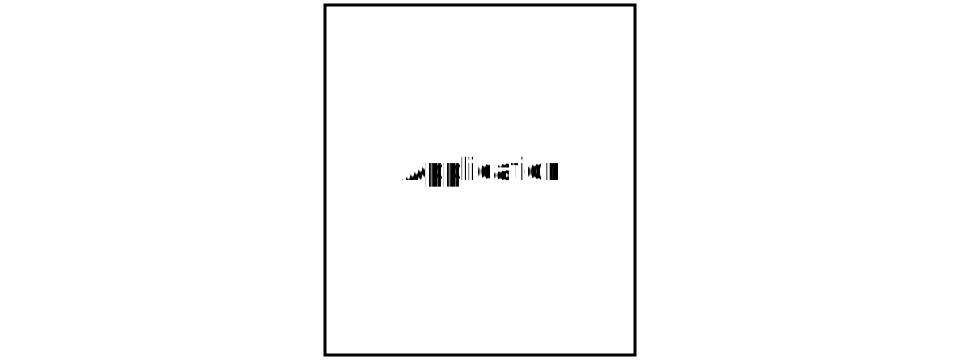

---

# So what is an application?

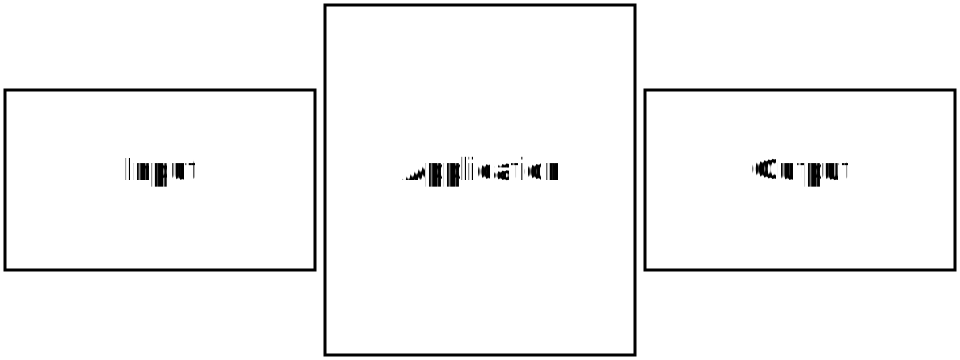

<!--
Talk about batch processing, paper tapes, etc
-->

---

# What does a DOS do?

- It runs applications ✅
- __It runs on a computer__
- It manages files (on disk)
- It provides portability

---

# What is a computer?

* Has a Central Processing Unit
	- Executes *Instructions*, has *Registers*
* Has memory:
	- Each location (a byte?) has a numeric address
	- Volatile vs Non-Volatile
* Has Input/Output devices
	- Often pretend to be memory
	- Display, Keyboard, Storage, Communications

<!-- You will need *some* non-volatile memory to boot, unless you want to flip toggle switches -->

---

<!-- _class: photo --> 

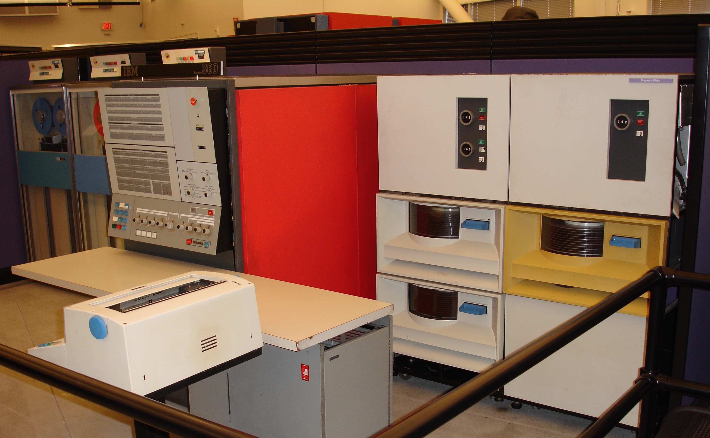

## IBM System/360 Model 30
###### Dave Ross - Flickr - CC BY 2.0

<!-- 1965-1978; 64Kx8 memory; 8-bit; microcoded; 1 MHz; 35k op/sec; 8 cycle register access; 2x 5MB Magnetic disk drives; $133k -->

---

<!-- _class: photo --> 

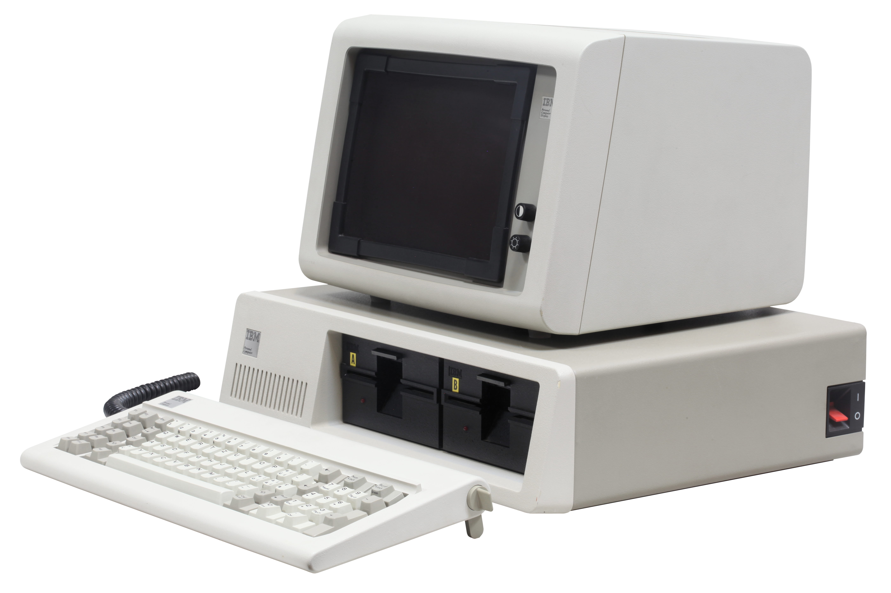

## IBM PC 5150
###### Rama & Musée Bolo - Wikimedia - CC BY-SA 2.0 fr

<!-- 1982; 4.77 MHz 8088; 64K RAM; 320K FDD; BASIC in ROM; Cassette interface... -->

---

<!-- _class: photo --> 


## Raspberry Pi Pico
###### Michael Henzler - Wikimedia - CC BY-SA 4.0

<!--
2021; 256K RAM; 2MB Flash; 2x 32-bit @ 133 MHz; $3.
Let's play higher-lower
-->

---

# So an application just runs on the CPU?

- Yes, and no.
	* How much memory do you have?
	* What I/O devices do you have?
	* Is that the same as what the author had?
	* Do you really want to write everything from scratch?

---

# What does a DOS do?

- It runs applications ✅
- It runs on a computer ✅
- __It manages files (on disk)__
- It provides portability

---


A - Track; B - Geometric Sector; C - Sector; D - Cluster

---

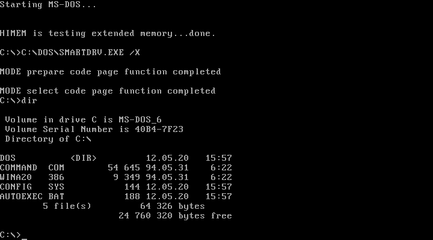

<!-- Name, Timestamp, Directory, Size, Location of Contents -->

---

# What does a DOS do?

- It runs applications ✅
- It runs on a computer ✅
- It manages files (on disk) ✅
- __It provides portability__

---

# What if there's no OS?

*or if the OS and Application are compiled together...*

* The Application runs from boot-up
* How do you load other Applications?
* How do you run the Application on a different computer?

---

# Can we save some work here?

- Like, move the *common* parts out of each application?
- The bits that *operate* the computer ... *system* ?

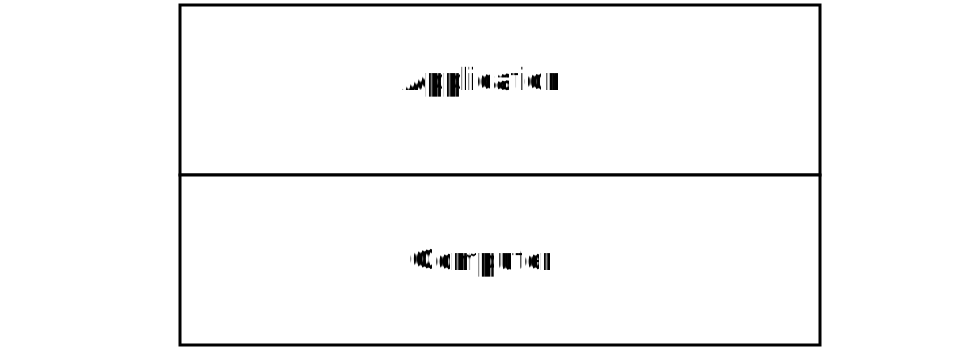

---

# So, can we save some work here?

- Like, move the *common* parts out of each application?
- The bits that *operate* the computer ... *system* ?

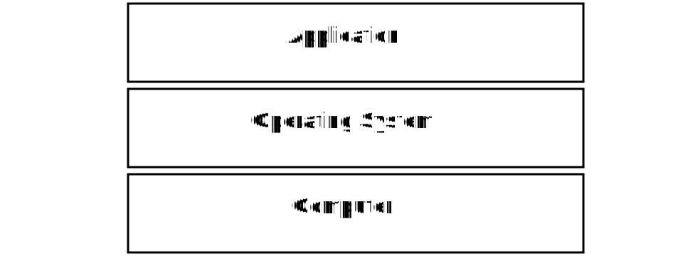

---

# What does a DOS do?

- It runs applications ✅
- It runs on a computer ✅
- It manages files (on disk) ✅
- It provides portability ✅

---

# Our Journey...

1. What is a 'DOS' (or even an 'OS')?
1. ☞ __A Brief History of the OS__ ☜
1. The OS Today
1. Introducing: Neotron

---

<!-- header: "2. A Brief History of the OS" -->

# The LEO "Master Programme"

* LEO I was the first commercial computer
	* Built by J. Lyon's Tea Rooms
	* Based on EDSAC
	* 6000 tubes, 1200 relays
* First ran the "Bakery Valuations" application in 1951
* LEO III's "Master Programme" ran up to 12 applications

---

## Debugging the LEO

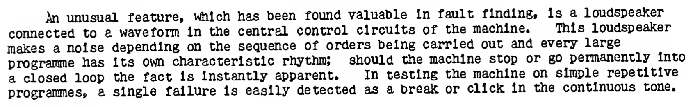

[Automatic Digital Computation, 1953](http://www.computinghistory.org.uk/pdfview/web/viewer.html?file=/downloads/54527#magazineMode=true)

<!-- bitsavers_onrASurveyomputers1953_8778395 -->

---

# IBM System/360 Operating System

* 1964
* Somewhat late and resource hungry
	* Various interim OSes launched, like BOS/360
* Three versions: Single-task, fixed-tasks, variable-tasks
	* Switched tasks when the CPU was stuck waiting
* System/360 shared peripherals, and mostly application compatible

<!-- Needed 32K, but really 128K or more. CPU speeds out-stripped disk speeds. Written in ASM. z/OS is compatible -->

---

# MULTICS

* MIT / General Electric / Bell Labs - 1969
* Time-sharing for GE-645
	* 36-bit word; 18-bit address/segment
* No distinction between files and RAM
* Dynamic linking
* Hierarchical File System
* Kernel/User-space
* Written in PL/I

<!--
Multiplexed Information and Computing Service
Honeywell bought GE's computer division
-->

---

# UNIX (or Unix)

* Bell Labs - 1969
* Ken Thompson, Dennis Ritchie, et. al
* Initially single-tasking; non-portable
	* written for the the DEC PDP-7, to play *Space Travel*
* Processes, Device Files, Hierarchical File System
* Proves useful for Word Processing (with `roff`)
* Re-written in *C* in 1973

<!-- Uniplexed Information and Computing Service. Ported to PDP-11/20 in 1970, roff written for processing patents -->

---

## The UNIX family tree

* Bell Labs' __Research Unix__ V1..V10
* AT&T __System III & V__
	* HP-UX, SGI IRIX, IBM AIX, Sun Solaris
* __Berkeley Software Distribution__
	* SunOS
	* Net/Open/Free/DragonFlyBSD
	* NeXTSTEP (macOS)
* Microsoft Xenix

---


<!-- This is the simple version!! -->
---

# Digital Research CP/M

* For 8-bit Intel 8080 machines - 1974
	* Altair, IMSAI, Osborne, KayPro, Commodore, Sinclair, Amstrad
* Needs an ASCII Terminal, floppy drive, 16 KiB RAM
* OEM ports the BIOS, Digital Research supply BDOS + CCP
* ~~Hierarchical~~ File System
* *pip* understands `CON:` as a __psuedo-file__ with *special properties*

<!-- single user, single tasking -->

---

# PC-DOS / MS-DOS

* The IBM 5150 'Personal Computer' - 1981
	* 16-bit Intel 8088
	* Microsoft BASIC in ROM, Tape interface, 16 to 64KB RAM
* Microsoft buy 16-bit CP/M clone 86-DOS and licence it to IBM
	* IBM do the BIOS, Microsoft provide DOS
* First 'PC Compatible' from Columbia Data Products
	* Microsoft sell MS-DOS to anyone - CP/M is doomed
* `CON` is a __psuedo-file__ with *special properties*

<!-- it was also sold with CP/M-86 and UCSD p-System but not at launch. You can't make a file called CON even on Windows 11 -->

---

# Other Microsoft OSes

* MS-DOS
* Xenix UNIX
* OS/2 with IBM
* 16-bit Windows (1.x, 2.x, 3.x)
* 16/32-bit Windows (95, 98, ME)
* 32-bit Windows NT (3.1, 3.5, 4, 2000, XP, Vista, 7, 8, 10, 11)

---


<!-- Windows 1.0, with non-overlapping windows! -->

---

### Microsoft Windows NT

* Released in 1993 as Windows NT 3.1
* Portable
	* MIPS, x86, DEC Alpha, PowerPC, Itanium, x86-64, arm
* Compatible
	* OS/2, POSIX, Win16, Win32...
* Dave Cutler + co. came from doing VMS at Digital

---

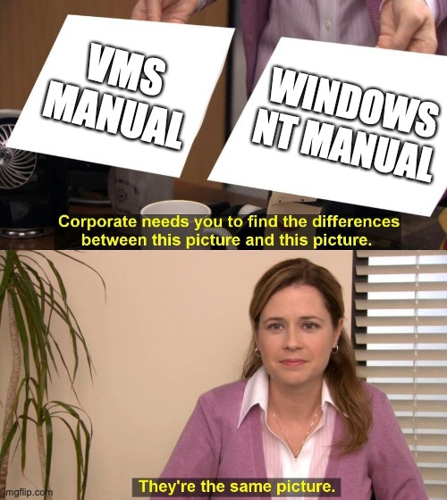

Microsoft said sorry with $100M + added DEC Alpha port

---

## Apple

* Almost nothing on the Apple I
* BASIC on the Apple II
* Lisa OS
	* Includes a GUI based on the Xerox Star
* Macintosh System
	* Cut-down Lisa OS
	* Later ported from 68k to a PowerPC microkernel
* Mac OS X is *UNIX'03* certified

<!-- 256 bytes of Wozmon! System isn't multi-tasking, and has a dumb name -->

---

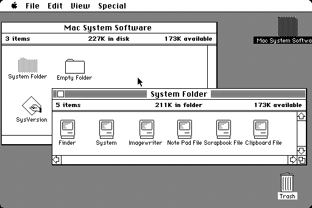

---

## Commodore

* Microsoft BASIC on the 8-bits
	* Commodore DOS ran on the Floppy Drive!
* AmigaOS...
	* *Exec* was the multi-tasking Kernel
	* *AmigaDOS* was the OS (based on TRIPOS)
	* *Intuition* was the GUI
	* Partially in ROM (Kickstart)

---

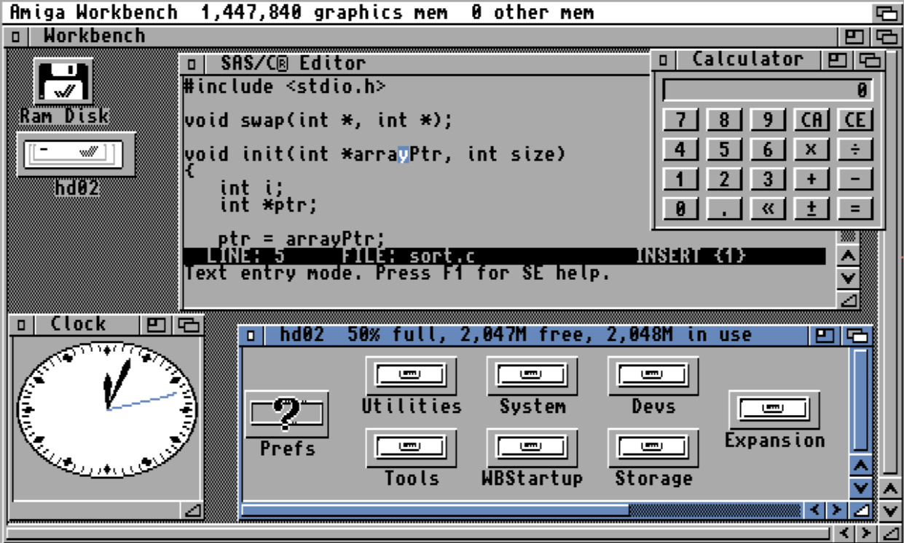

---

## Atari

* Atari OS + Atari DOS + Atari BASIC on the 8-bits
* TOS on the 16-bit machines
	* Digital Research GEM Desktop + GEMDOS
* MultiTOS on the 32-bit machines

---

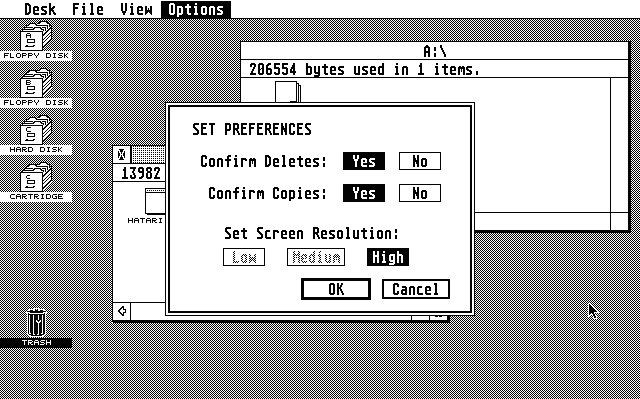

---

## Acorn

* MOS on the 8-bit machines (like the BBC Micro)
	* Disk Filing System
	* BBC BASIC was amazing
* RISC OS on the 32-bit machines
	* Advanced Disk Filing System
	* Still going!

---

<!-- _class: photo --> 

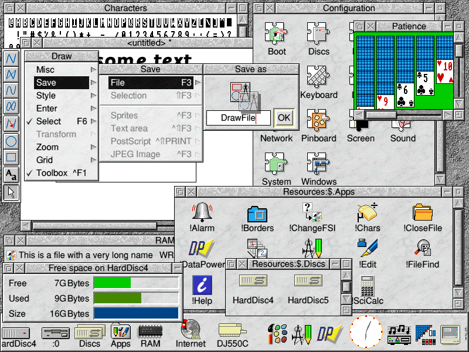

---

## Linux

* Is a Kernel
* GNU is Not Unix: C compiler, C library, shell, utilities
	* (more and more non-GNU components these days...)
* X11 compatible *Display Server* plus a *Window Manager*
* *Distributions* like Ubuntu, Arch, Slackware
	* It's like pick-n-mix

<!-- systemd, pipewire, Wayland - it's a pick-and-mix OS! -->

---

# Our Journey...

1. What is a 'DOS' (or even an 'OS')?
1. A Brief History of the OS
1. ☞ __The OS Today__ ☜
1. Introducing: Neotron

---

<!-- header: 3. The OS Today -->

# The OS Today

* ~~Commodore~~
* ~~CP/M~~
* ~~IBM~~ (well...)
* ~~Apple System/Carbon~~
* Microsoft Windows NT (Win32)
* POSIX (Portable Operating System Interface ... X?)
* ... WASI?

---

# Microsoft Windows NT

* Kernel-space vs User-space
* Kernel API is private
	* Must use OS supplied static libraries
* EXEs and DLLs
* Paths like `C:\WINDOWS\CANYON.MID`
* Functions like `CreateFileA()`

---

# POSIX/Linux
* Kernel-space vs User-space
* Kernel API is public
	* Use CPU *syscall* instructions
* Executables and Shared Objects
* Paths like `/home/jonathan/canyon.mid`
* Functions like `open()`

---

# POSIX/macOS
* Kernel-space vs User-space
* Kernel API is private
	* Must use OS supplied static libraries
* Executables and Shared Objects
* Paths like `/Users/jonathan/canyon.mid`
* Functions like `open()`

---

# Common APIs

* File Handling
	* Open, Close, Read, Write, Directories
* Console Handling
	* Reading / Writing Text
* Memory Management
* Networking (with Sockets)
* Processes and Threads
* Locks and RPC

---

# OS Interfaces

* *Application Programming Interface* (API)
	* Source-level compatiblity - function names, argument order
	* Support multiple CPU architectures
* *Application Binary Interface* (ABI)	
	* Binary-level compatibility - register/stack usage
	* Support single CPU architecture

<!-- Debian has no fixed API across x86/ARM/PPC/etc. FreeBSD AMD64 presents ABI compatibility with Linux AMD64 -->

---

# Making Portable *Languages*

* Modern languages provide a portable API over the *native* API
	* C++ STL
	* Python
	* Go
	* Rust
* Cygwin/MinGW brings POSIX to Windows NT

<!-- Rust on Windows comes in MSVC or MinGW flavours -->

---

# Our Journey...

1. What is a 'DOS' (or even an 'OS')?
1. A Brief History of the OS
1. The OS Today
1. ☞ __Introducing: Neotron__ ☜

---

<!-- header: 4. Introducing Neotron -->

# What is Neotron?

* Just Enough Operating System
	* Loadable Applications
	* Portable
	* Understandable
* Open Source
* Open Hardware

---

# What's wrong with Windows/Mac/Linux?

* OS APIs are learnable
	* Albeit growing...
* Kernels are hugely complicated
	* Especially drivers!
* *Operating Systems* even more so
	* They're both ancient...

---

# Why not an embedded system?

* Not general purpose
* *Well-solved problem*
* Nostalgia

---

# Why make an Open System?

* Longevity
* Education
* Money

---

# What is the smallest amount of OS we can get away with?

* File Handling
	* FAT32 on an SD Card
* Console Handling
	* VGA Monitor, PS/2 Keyboard
* Memory Management
	* Basic `malloc`/`free`

---

# What is the smallest amount of OS we can get away with?

* Networking (with Sockets)
	* Nope (well, maybe later...)
* Processes and Threads
	* Nope
* Locks and RPC
	* Nope

---

# Portability

* Solves the *driver problem*
	* I don't care about drivers for *your* machine
* Neotron-BIOS provides hardware-specific code
* The Neotron-OS provides hardware-independent code
* You supply the Application!

---

# Why Rust?

---

# BIOS / DOS ABI

* OS should be common for any BIOS
* Rust versions may not match
* Need to use `extern "C"` functions
* BIOS supplies a `struct` of function-pointers

---

# BIOS / DOS ABI

```rust
struct ApiStaticString {
	string: *const u8,
	length: usize
}

struct BiosApi {
	get_version: fn() -> ApiStaticString,
}
```

---

# DOS / Application ABI

* Works the same way
* Entry point gets `*const OsApi`
	* Calls normal C-style `main`

---

# Where is Neotron at right now?

---

# Questions!

* @therealjpster on Twitter
* https://github.com/neotron-compute
  