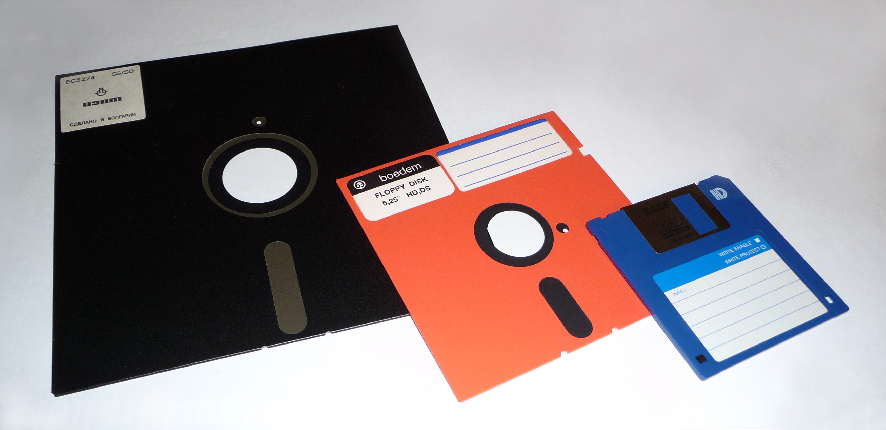

<!-- _class: lead -->
# Is the Raspberry Pi Pico a computer?
## Jonathan 'theJPster' Pallant

---

## Who am I?

- Embedded Systems Engineer
- Rust Programmer and Trainer
	- Formerly: C++, Python, Pascal, BASIC...
- Ferrous Systems ([ferrous-systems.com](https://www.ferrous-systems.com))
-  [github.com/thejpster](https://github.com/thejpster)
-  [@thejpster@hachyderm.io](https://hachyderm.io/@thejpster)
-  [neotron-compute.github.io](https://neotron-compute.github.io)

---

<!-- _class: lead -->

# Our question: Is the Raspberry Pi Pico a computer?

---

<!-- _class: lead -->

# What is a computer?

---

## Some examples...

* IBM System/360
* Altair 8800
* IBM PC 5150
* Commodore Amiga 500
* Apple iPad

---

## Some features...

* Processing Power
* Memory
* Input/Output
* Storage
* Can I run *my* code on it?

---

<!-- _class: photo --> 

## IBM System/360 Model 30 (1965)
###### Dave Ross - Flickr - CC BY 2.0

<!-- 1965-1978; 64Kx8 memory; 8-bit; microcoded; 1 MHz; 35k op/sec; 8 cycle register access; 2x 5MB Magnetic disk drives; $133k -->

---

<!-- _class: photo --> 

## MITS Altair 8800 (1975)

<!-- 1982; 2.0 MHz 8080; 1K RAM; No ROM; BASIC was optional (and required more RAM and was loaded from paper tape); Serial, Parallel or Audio Cassette interfaces were optional -->

---

<!-- _class: photo --> 

## IBM PC 5150 (1892)
###### Rama & Musée Bolo - Wikimedia - CC BY-SA 2.0 fr

<!-- 1982; 4.77 MHz 8088; 64K RAM; 320K FDD; BASIC in ROM; Cassette interface, $1500 (C64 was $595) -->

---

<!-- _class: photo --> 

## Commodore Amiga 500 (1987)
###### Bill Bertram - Wikipedia - CC BY 2.5

---

<!-- _class: photo --> 

## Apple MacBook M1 Pro (2021)
###### Premeditated - Wikipedia - CC BY-SA 4.0

---

## Processing Power

|      | System 360 | Altair 8800 | IBM PC | Amiga 500 | Mac Book |
| ---- | ---------- | ----------- | ------ | --------- | -------- |
| MIPS | 0.03       |

---

## Processing Power

|      | System 360 | Altair 8800 | IBM PC | Amiga 500 | Mac Book |
| ---- | ---------- | ----------- | ------ | --------- | -------- |
| MIPS | 0.03       | 0.3         |

---

## Processing Power

|      | System 360 | Altair 8800 | IBM PC | Amiga 500 | Mac Book |
| ---- | ---------- | ----------- | ------ | --------- | -------- |
| MIPS | 0.03       | 0.3         | 0.4    |

---

## Processing Power

|      | System 360 | Altair 8800 | IBM PC | Amiga 500 | Mac Book |
| ---- | ---------- | ----------- | ------ | --------- | -------- |
| MIPS | 0.03       | 0.3         | 0.4    | 1.4       |

---

## Processing Power

|      | System 360 | Altair 8800 | IBM PC | Amiga 500 | Mac Book |
| ---- | ---------- | ----------- | ------ | --------- | -------- |
| MIPS | 0.03       | 0.3         | 0.4    | 1.4       | ~200,000 |

---

## Memory

|        | System 360 | Altair 8800 | IBM PC | Amiga 500 | Mac Book    |
| ------ | ---------- | ----------- | ------ | --------- | ----------- |
| MIPS   | 0.03       | 0.3         | 0.4    | 1.4       | ~200,000    |
| Memory | 64K        | 1K          | 64K    | 512K      | 16,777,216K |

---

## Input/Output

|        | System 360 | Altair 8800 | IBM PC | Amiga 500 | Mac Book |
| ------ | ---------- | ----------- | ------ | --------- | -------- |
| MIPS   | 0.03       | 0.3         | 0.4    | 1.4       | ~200,000 |
| Memory | 64K        | 1K          | 64K    | 512K      | 16G      |
| I/O    | Serial     | Serial      | KB/TV  | KB/TV     | KB/LCD   |

---

<!-- _class: photo --> 

## ASR 33 Teletype
###### twitter.com/asr33

---

## Storage

|         | System 360 | Altair 8800 | IBM PC     | Amiga 500 | Mac Book   |
| ------- | ---------- | ----------- | ---------- | --------- | ---------- |
| MIPS    | 0.03       | 0.3         | 0.4        | 1.4       | ~200,000   |
| Memory  | 64K        | 1K          | 64K        | 512K      | 16G        |
| I/O     | Serial     | Serial      | KB/TV      | KB/TV     | KB/LCD     |
| Storage | Mag Tape   | Paper Tape  | 5.25" Disk | 3.5" Disk | NAND Flash |

---

<!-- _class: photo --> 

---

## Can I run *my* code on it?

|          | System 360 | Altair 8800 | IBM PC   | Amiga 500 | Mac Book   |
| -------- | ---------- | ----------- | -------- | --------- | ---------- |
| Memory   | 64K        | 1K          | 64K      | 512K      | 16G        |
| I/O      | Serial     | Serial      | KB/TV    | KB/TV     | KB/LCD     |
| Storage  | Mag Tape   | Paper Tape  | 5¼" Disk | 3½" Disk  | NAND Flash |
| Run Code | Yes        | Yes         | Yes      | Yes       | Yes        |

---

<!-- _class: photo --> 

## Apple iPad

---

## Is the iPad a computer?

|          | iPad (2010)       |
| -------- | ----------------- |
| MIPS     | 10,000            |
| Memory   | 256M              |
| I/O      | Touchscreen / LCD |
| Storage  | NAND Flash        |
| Run Code | ....?             |

---

<!-- _class: lead -->

# What is the Raspberry Pi Pico?

---

## A PCB with a Microcontroller

* Processor
* RAM
* Sometimes ROM
* Serial/Parallel Interfaces
* Clock / Phased-Locked-Loop

---

## The RP2040

* Two Arm Cortex-M0+ Processors
* 264 KiB RAM
* Interface for external NOR Flash ROM
* Lots of serial/parallel interfaces
* Requires external 12 MHz crystal

---

|          | System 360 | Altair 8800 | IBM PC     | Amiga 500 | Pi Pico |
| -------- | ---------- | ----------- | ---------- | --------- | ------- |
| MIPS     | 0.03       | 0.3         | 0.4        | 1.4       | 120     |
| Input    | Serial     | Serial      | KB         | KB        | Serial  |
| Output   | Serial     | Serial      | Monitor    | TV        | Serial  |
| Storage  | Mag Tape   | Paper Tape  | 5.25" Disk | 3.5" Disk | Flash   |
| Run Code | Yes        | Yes         | Yes        | Yes       | ...     |

---

## Can I run *my* code on it?

* Not without another computer!

---

<!-- _class: lead -->

# The Neotron Project

---

## What is it?

* An open-source computing platform, designed around Arm Microcontrollers
* The BIOS and OS are written in Rust

---

## Why it exists

> Neotron is an attempt to make computers simple again, whilst also taking advantage of the very latest in programming language development.

---

## Check list

* Off-the-shelf in-production components 
* Fully open source
* Possible to assemble at home
* Possible for one person to understand, top to bottom
* Is a *computer*

---

## The Neotron 32

---

## The Neotron Pico

---

## The Neotron Pico

* PS/2 Keyboard Input (+ Mouse)
* VGA Video Output
* SD Card for storage
* 16-bit stereo audio
* Four expansion slots

---

## What can it do?

* Read from a PS/2 Keyboard
* 80x25 or 80x50 text mode in 16 colours
* Tell the time
* Go beep
  * Technically, tell the other microcontroller to go beep
* Load applications
  * ... if you type in the raw bytes

---

## What's next?

* SD Card Support
* Load applications from SD card
* Audio support
* Built-in BASIC?
* Expansion cards...

---

# Conclusions!

---

<!-- _class: lead -->

# Is the Pi Pico a computer?

---

<!-- _class: lead -->

# Is the Pi Pico a computer?
# No

---

<!-- _class: lead -->

# Can you turn it into a computer?

---

<!-- _class: lead -->

# Can you turn it into a computer?
# Yes

---

<!-- _class: lead -->

# Would you like to see it?

---

<!-- _class: lead -->

# Would you like to see it?
# It's on display outside!

---

## Where can I found out more?

* <https://neotron-compute.github.io>
* My hackaday.io blog
* Bil Herd's YouTube channel
* @thejpster@hachyderm.io on Mastodon
